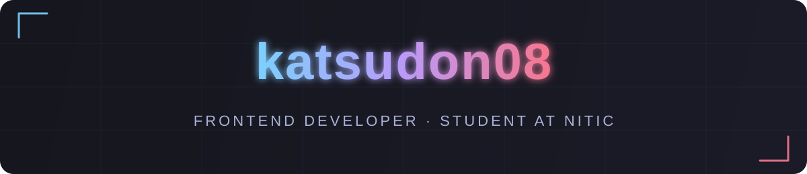

<!-- =========================  HEADER BANNER  ========================= -->

<!-- Typing animation -->

<!-- =========================  SOCIAL BADGES  ========================= -->

  <!-- TODO: X / LinkedIn を追加する場合はここにバッジを戻す（保留中） -->
  

<!-- =========================  ABOUT ME  ========================= -->
## 👨‍💻 About Me / 自己紹介

ユーザーの課題を起点にプロダクトを開発するエンジニアです。現在は小学生向けのプログラミング教育アプリを開発しています。 
本当に意味のある価値を届けるために、ユーザーの課題に対して仮説を立て、それを検証し続けることを大切にしています。

> As an engineer, I build products starting from user problems. Currently working on a programming education app for elementary school students. I value forming hypotheses about user problems and continuously validating them, in order to deliver truly meaningful value.

<!-- =========================  VISION  ========================= -->
## 🎯 Vision / 目指す姿

「なぜこれを作るのか？」を問い続け、単なる機能実装ではなく、ユーザーの課題視点から本質的な価値を届けられるエンジニアを目指しています。

> I strive to become an engineer who continuously thinks from the perspective of user problems and delivers essential value — always asking "Why are we building this?" rather than simply building features.

<!-- =========================  SKILLS  ========================= -->
## 🌱 Skills / 技術スタック

  

<!-- =========================  PROJECTS  ========================= -->
## 🚀 Projects / プロジェクト

<!-- =========================  STATS  ========================= -->
## 📈 Stats / 統計

 

  

<!-- =========================  CONTRIBUTION SNAKE  ========================= -->
## 🐍 Contribution Snake / コントリビューション

  <picture>
    <source media="(prefers-color-scheme: dark)" srcset="https://raw.githubusercontent.com/katsudon08/katsudon08/output/github-contribution-grid-snake-dark.svg" />
    <source media="(prefers-color-scheme: light)" srcset="https://raw.githubusercontent.com/katsudon08/katsudon08/output/github-contribution-grid-snake.svg" />
    
  </picture>

<!-- =========================  FOOTER  ========================= -->

⚡ <em>Thanks for stopping by! / 見てくれてありがとう！</em> ⚡

